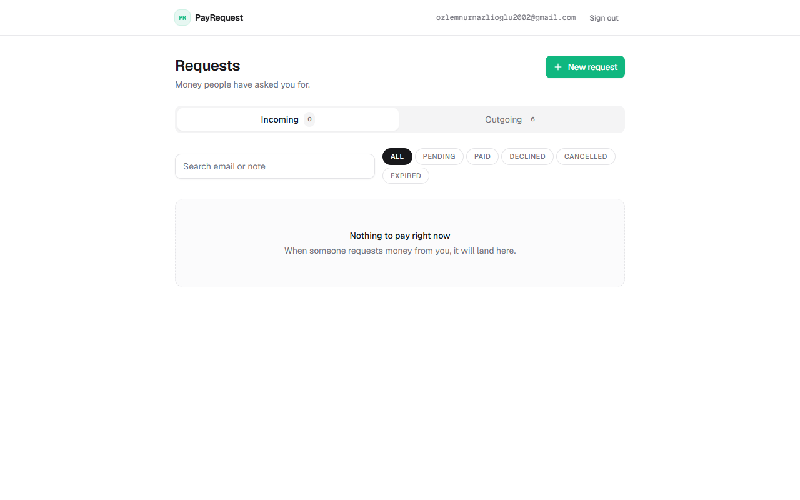
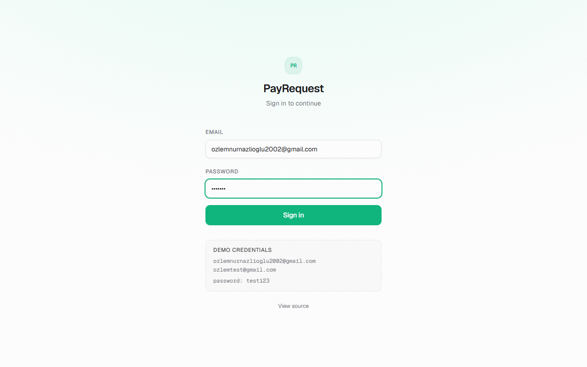
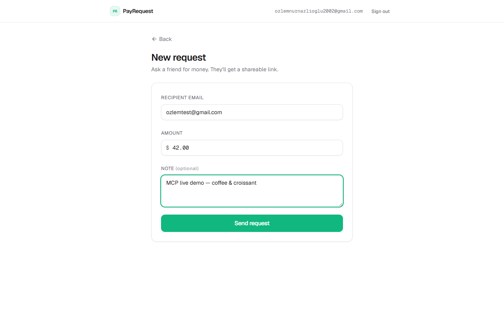
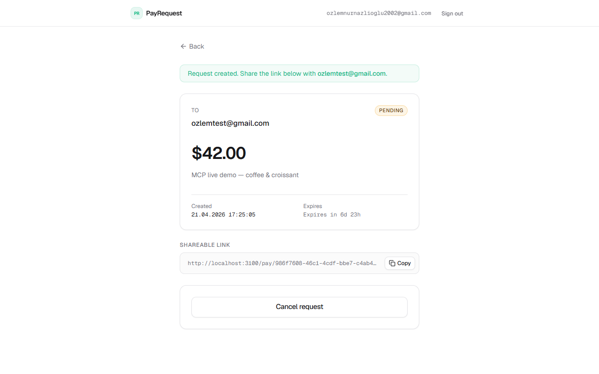
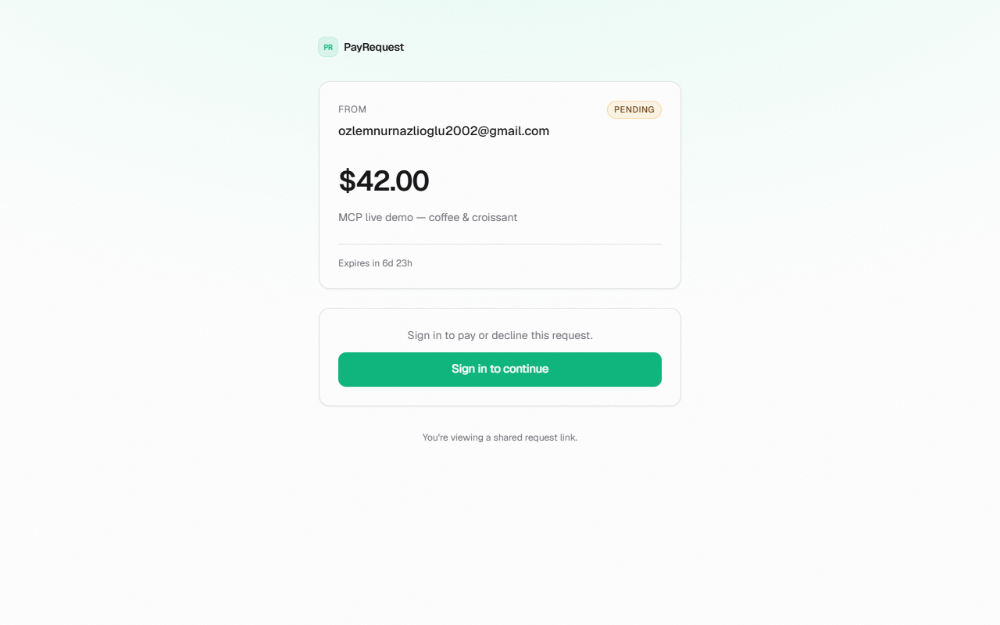
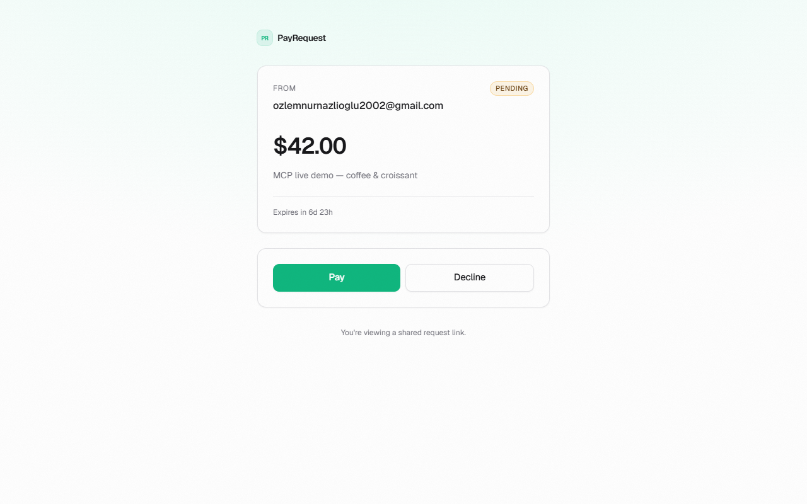
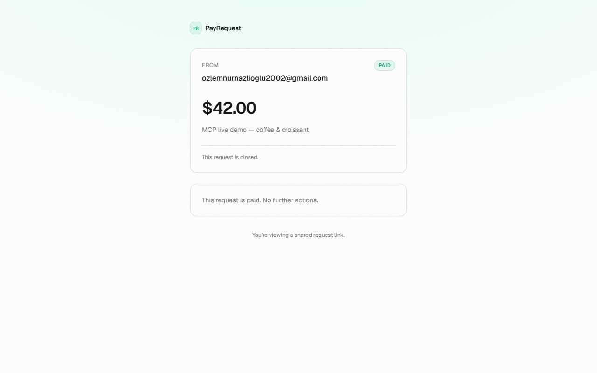
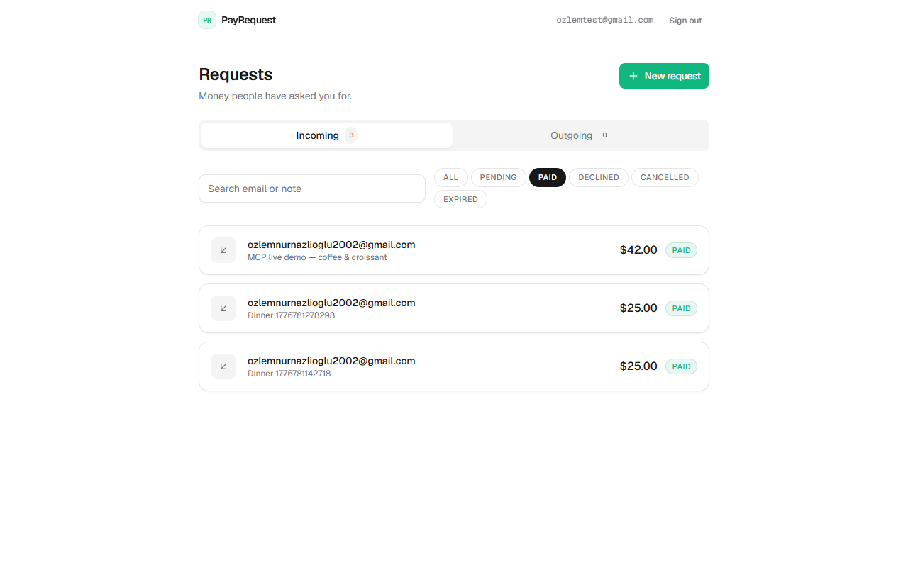
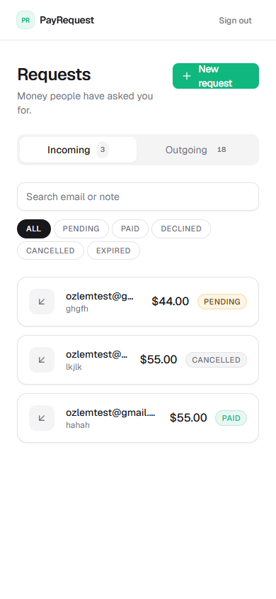
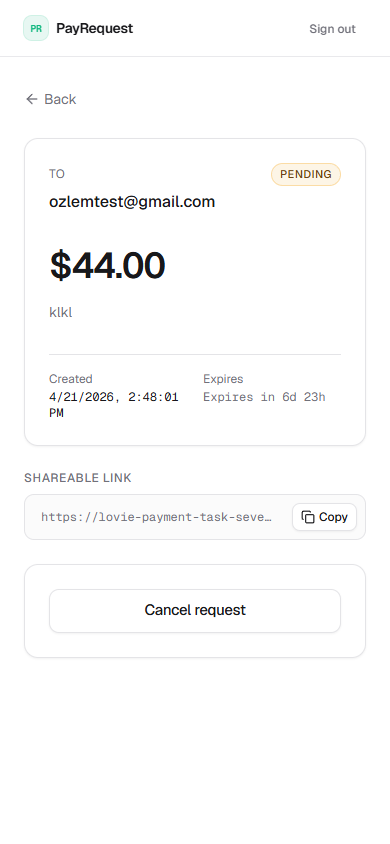

# PayRequest

A peer-to-peer payment request app (Venmo-style) built with a fully
**AI-native, spec-driven** workflow using [GitHub Spec-Kit](https://github.com/github/spec-kit),
Next.js 14 App Router, Supabase (Postgres + RLS), Tailwind, and Playwright.

- **Live demo:** <https://lovie-payment-task-seven.vercel.app>
- **Repo:** <https://github.com/ozlemnurazlioglu/lovie-payment-task>
- **Assignment brief:** [`assignment.md`](./assignment.md)
- **Constitution (5 non-negotiable fintech principles):** [`.specify/memory/constitution.md`](./.specify/memory/constitution.md)
- **Spec:** [`specs/001-payment-requests/spec.md`](./specs/001-payment-requests/spec.md)



---

## What it does

Any signed-in user can:

1. **Create a payment request** addressed to another email with an amount and optional note.
2. **Share a link** that opens a public read-only preview of the request.
3. The **recipient** signs in, **pays** (2-second simulated processing) or
   **declines**.
4. The **sender** can **cancel** while the request is still pending.
5. Requests **auto-expire after 7 days** (enforced server-side).

Both parties see the request and its current status on their dashboard
with Incoming / Outgoing tabs, status filter, and search.

---

## Screens

| Step                              | Image                                                  |
| --------------------------------- | ------------------------------------------------------ |
| Login                             |                      |
| Dashboard (empty incoming)        |         |
| New request                       |           |
| Request detail (sender / pending) |     |
| Public pay link (guest)           |           |
| Public pay link (recipient)       |       |
| Paid                              |               |
| Dashboard with paid filter        |      |
| Mobile — dashboard (390 × 844)    |           |
| Mobile — request detail           |              |

---

## Demo videos

Auto-recorded by the Playwright E2E suite (`video: 'on'`) while driving a real
Chromium browser — every test produces a `.webm`. Each video below covers one
functional requirement end-to-end.

| # | Flow | Asserts (spec ref) | Video |
| - | ---- | ------------------ | ----- |
| 1 | A signs in and creates a $25 request for B | FR-1, FR-4, FR-5 | [`docs/videos/01-create-request.webm`](docs/videos/01-create-request.webm) |
| 2 | Guest sees read-only public view of the share link | FR-11 | [`docs/videos/02-guest-view-public-link.webm`](docs/videos/02-guest-view-public-link.webm) |
| 3 | B signs in via the share link and pays — shows the 2-second processing animation | FR-8, FR-12 | [`docs/videos/03-recipient-pays-2s-processing.webm`](docs/videos/03-recipient-pays-2s-processing.webm) |
| 4 | A's outgoing tab flips to `paid` | FR-6 | [`docs/videos/04-sender-sees-paid.webm`](docs/videos/04-sender-sees-paid.webm) |
| 5 | Decline flow — A creates a fresh request | FR-1 | [`docs/videos/05-decline-flow-create.webm`](docs/videos/05-decline-flow-create.webm) |
| 6 | Decline flow — B declines | FR-9 | [`docs/videos/06-decline-flow-decline.webm`](docs/videos/06-decline-flow-decline.webm) |
| 7 | Cancel flow — A creates and cancels | FR-10 | [`docs/videos/07-cancel-flow.webm`](docs/videos/07-cancel-flow.webm) |
| 8 | Validation — self-request blocked with clear error | FR-2 | [`docs/videos/08-self-request-blocked.webm`](docs/videos/08-self-request-blocked.webm) |

Each clip is 2–15 s, ≤ 230 KB. Regenerate by running
`npx playwright test` — the suite writes fresh `.webm` + `trace.zip` to
`test-results/` and an HTML report to `playwright-report/`.

---

## Tech stack

| Layer         | Choice                                                      |
| ------------- | ----------------------------------------------------------- |
| Framework     | Next.js 14 (App Router, RSC), TypeScript (`strict: true`)   |
| Auth + DB     | Supabase (Postgres 15 + GoTrue), `@supabase/ssr`, RLS       |
| Validation    | Zod (shared client + server schemas)                        |
| Styling       | Tailwind CSS + custom shadcn-style primitives, Geist Sans   |
| Testing       | `@playwright/test` with video / trace / screenshot recording |
| Hosting       | Vercel                                                      |

---

## Spec-driven workflow

The build followed an 8-step workflow (see [`doc-video.md`](./doc-video.md)):

1. **MCP stack** — confirm Supabase, Playwright, Context7, GitHub, Vercel MCPs are connected.
2. **Setup** — scaffold Spec-Kit dirs + `.claude/settings.json` hooks
   (Prettier + ESLint on every `Edit`/`Write`, `tsc --noEmit` on `Stop`).
3. **Spec writing** — constitution, spec, plan, tasks, research, data-model, API contract, quickstart (8 docs, ~1,440 lines) **before any code**.
4. **Database via Supabase MCP** — schema applied through
   `mcp__supabase__apply_migration`; RLS + trigger + helper functions.
5. **Auth** — email + password (per [`research.md` R-1](./specs/001-payment-requests/research.md)) + middleware + seed users.
6. **Feature build** — 7 API routes + dashboard / new / detail / public-pay pages + 7 shared components.
7. **E2E tests** — Playwright MCP for real-browser visual verification _and_
   a `@playwright/test` suite producing a video + trace + HTML report.
8. **Ship** — screenshots, commit, push, deploy, this README.

---

## Architecture highlights

- **Monetary integrity** (Constitution §1): every amount is `INTEGER` cents.
  `toCents()` / `formatCents()` live in [`src/lib/money.ts`](./src/lib/money.ts). No floats touch money.
- **Row-level security** (§2): RLS enabled on both tables with
  `USING` + `WITH CHECK` clauses; `auth.uid()` always wrapped in
  `(SELECT auth.uid())` per [Supabase RLS-performance guidance](https://supabase.com/docs/guides/database/postgres/row-level-security#rls-performance-recommendations).
- **Dual-side validation** (§3): the same Zod schema in
  [`src/lib/validators.ts`](./src/lib/validators.ts) runs on the client form _and_ in every route handler.
- **Race-condition safety** (§4): every pay / decline / cancel issues a
  guarded `UPDATE … WHERE status='pending' AND expires_at>now()` and checks
  the affected-row count. See
  [`src/app/api/requests/[id]/pay/route.ts`](./src/app/api/requests/[id]/pay/route.ts).
- **Time-bounded lifecycle** (§5): `expires_at = created_at + 7 days`,
  enforced at the DB layer (default) and re-checked in every route handler.
- **Public shareable link:** the `/api/public/[link]` endpoint doesn't rely
  on a permissive RLS policy; it calls a narrow `SECURITY DEFINER` function
  `public.get_public_request(uuid)` that returns a redacted projection.
  See [`supabase-schema.sql`](./supabase-schema.sql).

---

## File structure

```
src/
├── app/
│   ├── (protected)/      auth-required pages (dashboard, requests/new, requests/[id])
│   ├── api/              7 route handlers
│   ├── login/            email + password form + server action
│   ├── pay/[link]/       public share-link page
│   └── signout/          POST → /login
├── components/           ui/ primitives + shared (RequestCard, StatusBadge, …)
├── lib/                  supabase clients, money, validators, api-error, types
└── middleware.ts         refreshes session + /login ⇄ /dashboard gating
tests/                    payment-flow.spec.ts  (8 tests, video + trace on)
specs/001-payment-requests/  spec, plan, tasks, research, data-model, API contract, quickstart
.specify/memory/         constitution.md — 5 non-negotiable fintech principles
supabase-schema.sql      full DDL applied via Supabase MCP
```

---

## Running locally

Requires Node 20+ and a Supabase project with the schema from
[`supabase-schema.sql`](./supabase-schema.sql) applied.

```bash
git clone https://github.com/ozlemnurazlioglu/lovie-payment-task.git
cd lovie-payment-task
cp .env.local.example .env.local
# fill NEXT_PUBLIC_SUPABASE_URL, NEXT_PUBLIC_SUPABASE_ANON_KEY, NEXT_PUBLIC_APP_URL
npm install
npm run dev
```

Open <http://localhost:3000>.

### Seed users (dev only)

The two test users are created via SQL (not GoTrue signup) to avoid
rate-limited magic-link flows. See the DO block in
[`supabase-schema.sql`](./supabase-schema.sql) or the `Step 5` sub-action in
[`doc-video.md`](./doc-video.md):

```
ozlemnurnazlioglu2002@gmail.com   /   test123
ozlemtest@gmail.com                /   test123
```

---

## Running the E2E suite

Chromium (≈170 MB) is downloaded the first time:

```bash
npx playwright install chromium
npx playwright test                 # headless
npx playwright test --headed        # watch it drive Chrome live
npx playwright show-report          # opens HTML report
npx playwright show-trace test-results/<dir>/trace.zip   # timeline + video
```

The config ([`playwright.config.ts`](./playwright.config.ts)) starts the dev
server on port **3100** via its `webServer` option. `video: 'on'`,
`trace: 'on'`, `screenshot: 'only-on-failure'`.

What the 8 tests cover (all 8 passing, ~55 s wall-clock):

| #  | Test                                                          | Asserts                                                       |
| -- | ------------------------------------------------------------- | ------------------------------------------------------------- |
| 1  | A signs in and creates a request for B                        | FR-1, FR-4, FR-5, `amount_cents`, pending badge, share link   |
| 2  | Guest sees public read-only view                              | FR-11, CTA preserves `?next=`                                 |
| 3  | B signs in via link and pays                                  | FR-8, FR-12 — also **asserts server sleep ≥ 1800 ms**         |
| 4  | A sees paid in Outgoing tab                                   | FR-6 two-side visibility                                      |
| 5  | A creates a fresh request (decline flow)                      | FR-1                                                          |
| 6  | B declines                                                    | FR-9                                                          |
| 7  | A cancels a pending request                                   | FR-10                                                         |
| 8  | Self-request is blocked with a clear error                    | FR-2                                                          |

---

## AI tools used

This repo is a demonstration of **agentic, MCP-driven** development.

- **Claude Code** (Opus 4.7, 1M context) — the whole build, from constitution to tests to deploy.
- **Supabase MCP** — applied the schema migration, seeded users, pulled logs, resolved the GoTrue NULL-token auth bug directly from chat.
- **Playwright MCP** — drove a real Chromium to visually verify every page before writing the automated suite (see `docs/screenshots/`).
- **Context7 MCP** — version-accurate docs for Next.js 14 App Router, `@supabase/ssr`, Playwright.
- **GitHub MCP** — this commit + push.
- **Vercel MCP** — deploy.
- Two Claude plugins / skills were invoked:
  - `frontend-design` — enforced a refined, fintech-minimal UI (no purple gradients, no generic AI look).
  - `supabase-postgres-best-practices` — caught the
    `auth.uid() → (SELECT auth.uid())` RLS-performance pitfall before the migration was applied.

### Hooks

`.claude/settings.json` wires two hooks:

- `PostToolUse` (on `Edit|Write|MultiEdit`) runs
  `npx prettier --write --ignore-unknown` and
  `npx eslint --fix --no-error-on-unmatched-pattern` on the changed file.
- `Stop` runs `npx tsc --noEmit` if `tsconfig.json` exists.

---

## Key assumptions / deferred decisions

Recorded in [`specs/001-payment-requests/research.md`](./specs/001-payment-requests/research.md):

- Email + password auth, not magic link (magic-link rate limits break E2E tests).
- `amount_cents INTEGER`, not `numeric(10,2)`.
- Status is a Postgres `ENUM`, not a lookup table.
- `expires_at` is stored, not computed (indexable, future-flexible).
- Shareable link is a `gen_random_uuid()` — 122 bits of entropy.
- Pay 2-second delay is **server-side** (`setTimeout(2000)` in the route
  handler), so a `curl` against the endpoint also experiences it.
- The public share endpoint uses a `SECURITY DEFINER` function, not a
  permissive RLS policy. Knowledge of the UUID is the authorization.
- No unit tests in the MVP; E2E + types + RLS + SQL checks cover the bases.

Out of scope: real money movement, multi-currency, notifications,
partial payments, group split, admin console, i18n.

---

## Cover note

**What was most challenging:** Three things, all below the surface.
(1) GoTrue's Go struct scanner refusing to convert NULL → string for six
token columns — needed a direct `auth.users` update to empty-string those
fields when seeding test users via SQL. Diagnosed via Supabase MCP
`get_logs` on the auth service. (2) Playwright's `waitForURL` default
`waitUntil: 'load'` never firing on Next.js client-side navigations —
swapped to `expect(page).toHaveURL(...)` assertion-based polling.
(3) `video: 'on'` in the Playwright config only applies to the default
`page` fixture; fresh `browser.newContext()` calls need their own
`recordVideo` option, otherwise most tests silently produce no `.webm`.

**How AI tools helped (or hindered):** The spec-driven workflow scales
linearly with AI competence — writing 1,440 lines of authoritative spec
_before_ any code meant every subsequent step reduced to "follow the
contract". Claude Code + MCPs made the debug loops 3–5× faster than they
would have been with just autocomplete: the GoTrue NULL-token bug was
identified by feeding the error string into Supabase MCP logs, not by
hand-grepping through a Go repo. The only friction was Windows-native
tooling: `uvx specify init` stalled on interactive prompts twice, so I
hand-scaffolded the `.specify/` tree in parallel.

---

## License

MIT. See [`LICENSE`](./LICENSE) if present.
